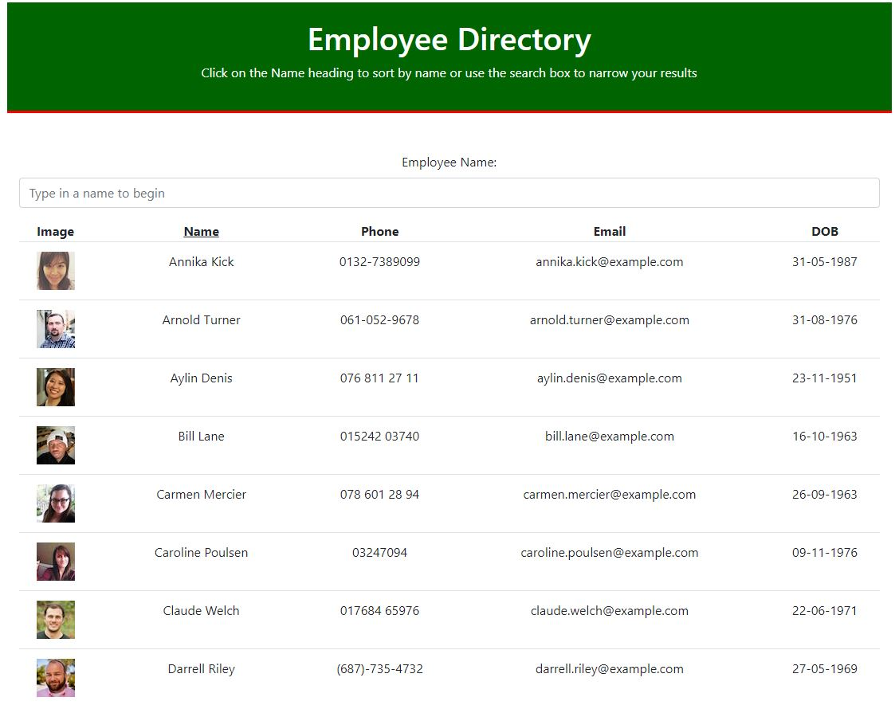
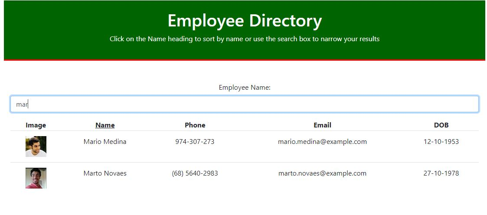

# Employee Directory
This is a React app which fetches employee data from an api to display, search and sort by employee name.
The link to the deployed site is here: https://bevhatzl.github.io/employee-directory/

# Table of Contents
* [Instructions](#instructions)
* [Built With](#built-with)
* [Screenshots](#screenshots)
* [Future Development](#future-development)
* [Author](#author)

## Instructions

Initial display will show a result of 50 employees fetched from the Random User Generator API.

To sort by employee name, type the name into the input field. Search will update as each letter is typed. To sort name by reverse alphabetical order click the underlined "Name" heading. Click again to sort back to alphabetical order.

## Built With

* [VScode] (https://code.visualstudio.com/) 
* [Random User Generator API] (https://randomuser.me/)

## Screenshots

## Future Development

Future versions will be more responsive.

## Author
Beverley Hatzl 2021
